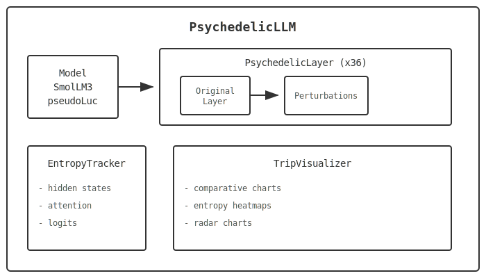
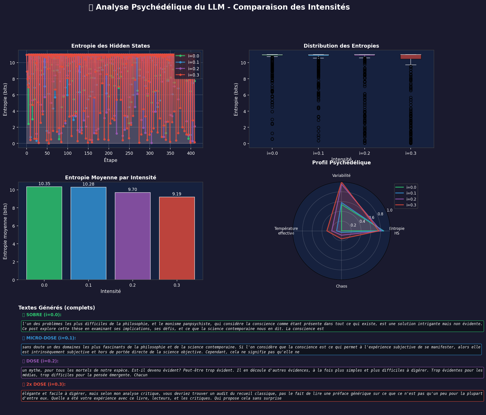
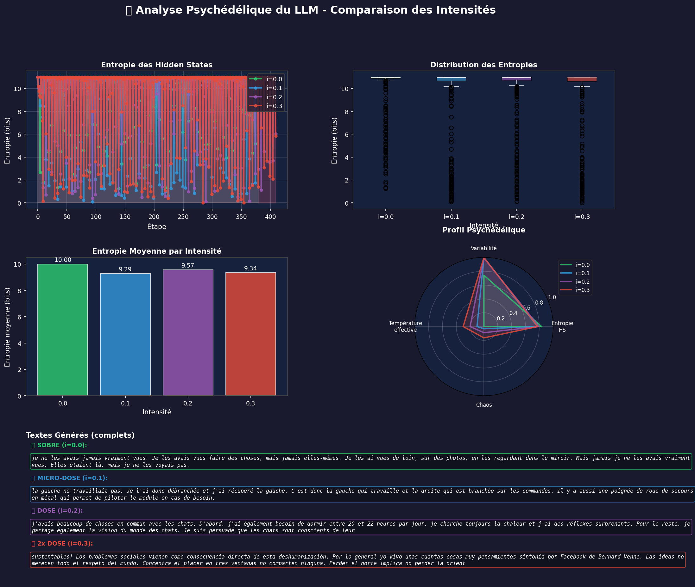
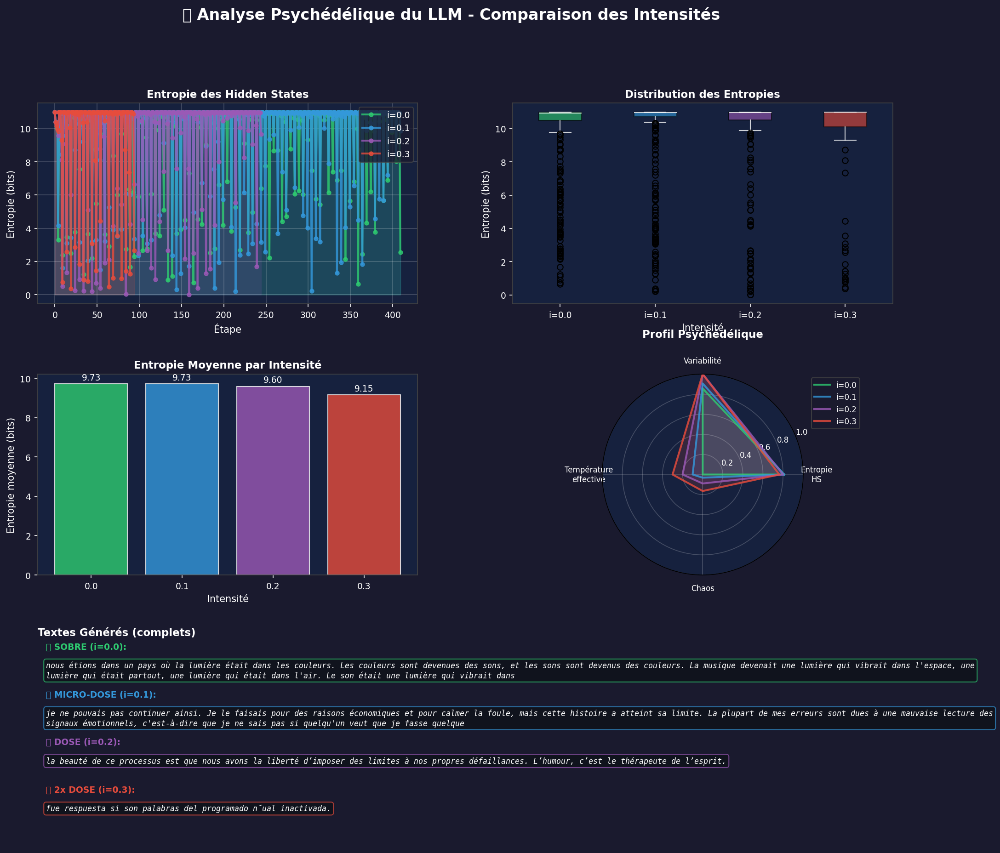
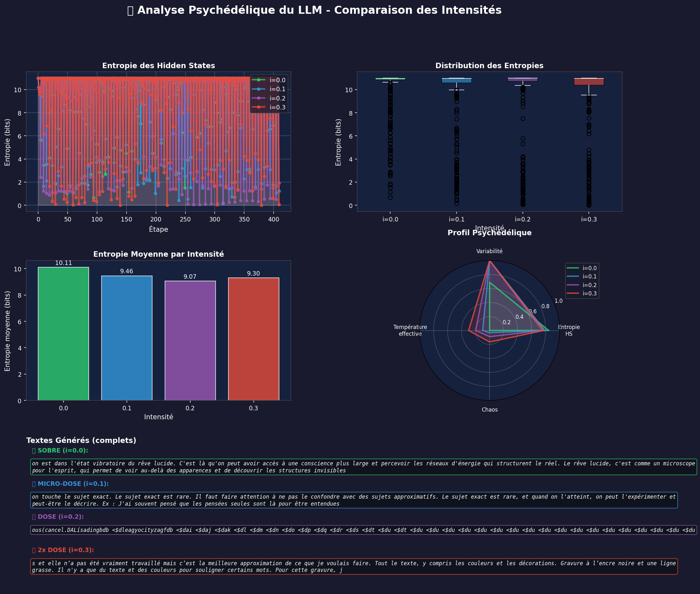
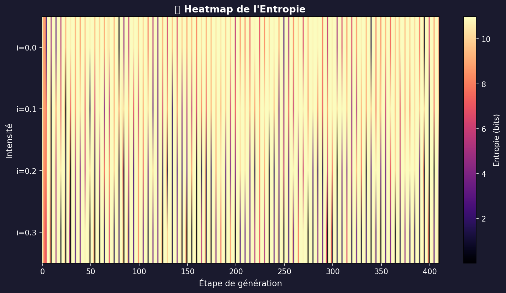
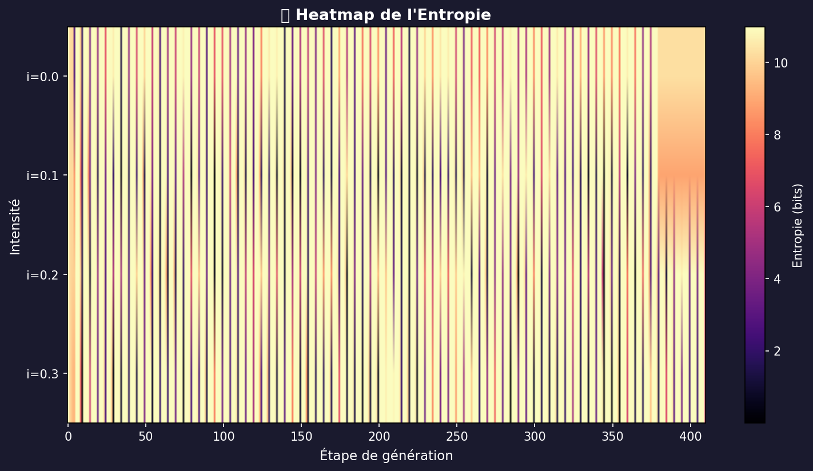
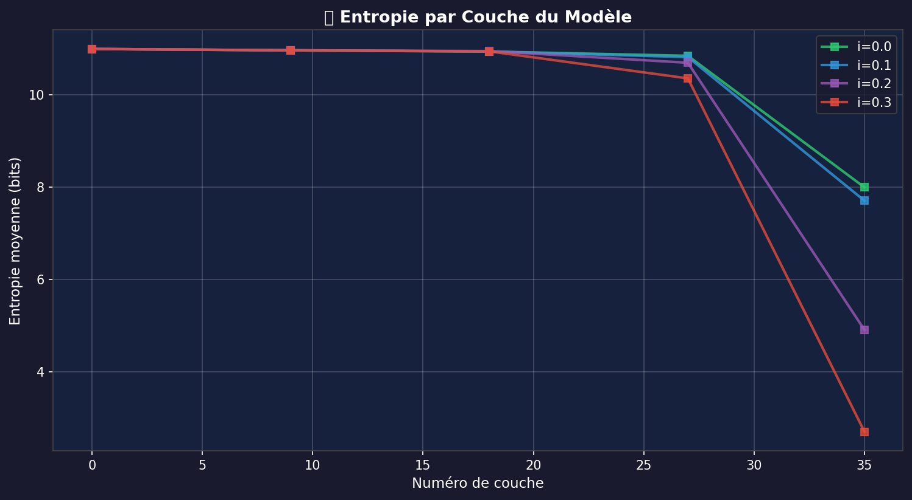
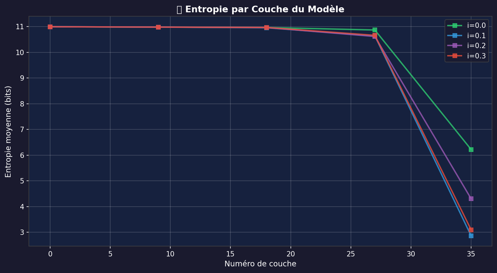

# Psychedelic LLM Explorer

Exploring "altered states of consciousness" in LLMs by perturbing their internal representations.

## Concept

This project is inspired by Robin Carhart-Harris's **Entropic Brain Theory**. The idea is to transpose this concept to LLMs by perturbing the internal activations of transformer layers during generation.

**Note:** The model used here is **pseudoLuc**, a personality clone fine-tuned on French text. All generated outputs are therefore in French, with English translations provided below.

---

## Robin Carhart-Harris and the Entropic Brain Theory

### The Researcher

Robin Carhart-Harris is a British neuroscientist, currently director of the Neuroscape Psychedelics Division at UCSF. He pioneered modern psychedelic research at Imperial College London, conducting the first brain imaging studies on LSD and psilocybin since the 1960s.

### The "Entropic Brain" Theory (2014, revised 2018)

#### Core Idea

The brain normally operates in a **sub-critical** state - a balance between order and chaos. Psychedelic states push the brain toward a **supercritical** state, characterized by higher entropy.

#### The Default Mode Network (DMN)

The DMN is a brain network active at rest, associated with:
- Rumination, self-reflection
- The "narrative self" (continuous sense of self)
- Automatic thinking, repetitive patterns

**Under psychedelics**: The DMN temporarily disintegrates. This dissolution correlates with:
- The experience of "ego dissolution"
- Reduction of ruminative thoughts
- Emergence of new perspectives

#### Entropy = Cognitive Flexibility

```
Low entropy              │         High entropy
─────────────────────────┼─────────────────────────
Cognitive rigidity       │   Cognitive flexibility
Repetitive thinking      │   Divergent thinking
Depression, addiction    │   Creativity, insight
Stuck patterns           │   New connections
```

Carhart-Harris proposes that certain disorders (depression, addiction, OCD) correspond to states of entropy that are too low - the brain stuck in rigid patterns. Psychedelics "shake the system" by temporarily increasing entropy.

### The REBUS Model (2019)

**R**elaxed **B**eliefs **U**nder **P**sychedelics

An extension of the theory integrating the predictive processing framework:

1. The brain builds "priors" - world models that filter perception
2. These priors sometimes become too rigid (pathologically "precise")
3. Psychedelics **relax** these priors, allowing revision of deep beliefs

This is why psychedelics can help with treatment-resistant depression - they allow "unfreezing" of automatic negative thought patterns.

### Application to LLMs

| Brain | LLM |
|-------|-----|
| Neurons, synapses | Weights, activations |
| DMN, established patterns | Learned representations |
| Neural entropy | Hidden state entropy |
| Ego dissolution | Embedding perturbation |
| New connections | Unusual semantic associations |

By perturbing intermediate layers (analogous to "abstract representations"), we hope to see creative associations emerge rather than the model's usual patterns.

---

## Architecture



## Perturbation Mechanisms

### 1. Gaussian Noise Injection (`_inject_noise`)

**Cognitive analogy**: Dissolution of boundaries between concepts

```python
noise = random_normal(shape) * noise_scale * std(activations)
output = activations + noise
```

Noise is proportional to activation magnitude to preserve relative scale. This "blurs" representations, allowing normally distinct concepts to mix.

### 2. Phase Rotation (`_phase_scramble`)

**Cognitive analogy**: Synesthesia, mixing of modalities

```python
# 2D rotation on dimension pairs
x1_rot = x1 * cos(angle) - x2 * sin(angle)
x2_rot = x1 * sin(angle) + x2 * cos(angle)
output = blend(original, rotated)
```

Applies a rotation in representation space. Dimensions encode different semantic aspects; rotating them creates unusual associations.

### 3. Dimension Shuffle (`_dimension_shuffle`)

**Cognitive analogy**: Unusual connections between concepts

```python
shuffled_part = roll(activations[:shuffle_size], shift)
output = blend(original, shuffled)
```

Cyclically shifts a portion of features, creating semantic "short-circuits".

### 4. Cross-Dimension Bleed (`_cross_dimension_bleed`)

**Cognitive analogy**: Dissolution of perceptual boundaries

```python
blurred = (x + x_left * factor + x_right * factor) / (1 + 2*factor)
```

Sliding average over adjacent dimensions - information "bleeds" between neighboring representations.

## Layer Sensitivity

Not all layers are equally perturbed. A Gaussian curve centered on middle layers modulates the effect:

```python
sensitivity = exp(-((layer_pos - 0.5)² / 0.08))
```

**Why?**
- **Early layers**: Encode low-level patterns (tokens, syntax). Perturbing them too much produces gibberish.
- **Middle layers**: Encode abstract semantic representations. This is where perturbations create "interesting" effects.
- **Late layers**: Prepare next token prediction. Too much perturbation prevents coherent output.

## Intensity Parameters

| Intensity | Name | noise_scale | phase_rotation | dimension_shuffle |
|-----------|------|-------------|----------------|-------------------|
| 0.0 | Sober | 0 | 0 | 0 |
| 0.1 | Micro-dose | 0.025 | 0.01 | 0.008 |
| 0.2 | Dose | 0.05 | 0.02 | 0.016 |
| 0.3 | 2x Dose | 0.075 | 0.03 | 0.024 |

Effective values are modulated by each layer's sensitivity.

---

## Results

### Prompt 1: "La nature de la conscience est"
*(The nature of consciousness is)*



#### Generated Texts

**SOBER (i=0.0)** - Entropy: 10.35 bits

> l'un des problèmes les plus difficiles de la philosophie, et le monisme panpsychiste, qui considère la conscience comme étant présente dans tout ce qui existe, est une solution intrigante mais non évidente. Ce post explore cette thèse en examinant ses implications, ses défis, et ce que la science contemporaine nous en dit.

*Translation: "one of the most difficult problems in philosophy, and panpsychist monism, which considers consciousness as present in everything that exists, is an intriguing but not obvious solution. This post explores this thesis by examining its implications, its challenges, and what contemporary science tells us about it."*

**MICRO-DOSE (i=0.1)** - Entropy: 10.28 bits

> sans doute un des domaines les plus fascinants de la philosophie et de la science contemporaine. Si l'on considère que la conscience est ce qui permet à l'expérience subjective de se manifester, alors elle est intrinsèquement subjective et hors de portée directe de la science objective.

*Translation: "undoubtedly one of the most fascinating domains of philosophy and contemporary science. If we consider that consciousness is what allows subjective experience to manifest, then it is intrinsically subjective and beyond the direct reach of objective science."*

**DOSE (i=0.2)** - Entropy: 9.70 bits

> un mythe, pour tous les mortels de notre espèce. Est-il devenu évident? Peut-être trop évident. Il en découle d'autres évidences, à la fois plus simples et plus difficiles à digérer. Trop évidentes pour les médias, trop difficiles pour la pensée émergente.

*Translation: "a myth, for all mortals of our species. Has it become obvious? Perhaps too obvious. Other evidences follow from it, both simpler and harder to digest. Too obvious for the media, too difficult for emergent thought."*

**2x DOSE (i=0.3)** - Entropy: 9.19 bits

> élégante et facile à digérer, mais selon mon analyse critique, vous devriez trouver un audit du recueil classique, pas le fait de lire une préface générique sur ce que ce n'est pas qu'un peu pour la plupart d'entre eux.

*Translation: "elegant and easy to digest, but according to my critical analysis, you should find an audit of the classic collection, not reading a generic preface about what it's not just a little for most of them." (Note: coherence degrades)*

---

### Prompt 2: "Quand j'ai regardé mes mains, j'ai réalisé que"
*(When I looked at my hands, I realized that)*



#### Generated Texts

**SOBER (i=0.0)** - Entropy: 10.00 bits

> je ne les avais jamais vraiment vues. Je les avais vues faire des choses, mais jamais elles-mêmes. Je les ai vues de loin, sur des photos, en les regardant dans le miroir. Mais jamais je ne les avais vraiment vues. Elles étaient là, mais je ne les voyais pas.

*Translation: "I had never really seen them. I had seen them do things, but never themselves. I saw them from afar, in photos, looking at them in the mirror. But I had never really seen them. They were there, but I didn't see them."*

**MICRO-DOSE (i=0.1)** - Entropy: 9.29 bits

> la gauche ne travaillait pas. Je l'ai donc débranchée et j'ai récupéré la gauche. C'est donc la gauche qui travaille et la droite qui est branchée sur les commandes. Il y a aussi une poignée de roue de secours en métal qui permet de piloter le module en cas de besoin.

*Translation: "the left one wasn't working. So I unplugged it and recovered the left one. So it's the left that works and the right that's connected to the controls. There's also a metal spare wheel handle that allows piloting the module if needed." (Note: unexpected technical tangent)*

**DOSE (i=0.2)** - Entropy: 9.57 bits

> j'avais beaucoup de choses en commun avec les chats. D'abord, j'ai également besoin de dormir entre 20 et 22 heures par jour, je cherche toujours la chaleur et j'ai des réflexes surprenants. Pour le reste, je partage également la vision du monde des chats.

*Translation: "I had a lot in common with cats. First, I also need to sleep between 20 and 22 hours a day, I always seek warmth, and I have surprising reflexes. For the rest, I also share the cats' worldview."*

**2x DOSE (i=0.3)** - Entropy: 9.34 bits

> sustentables! Los problemas sociales vienen como consecuencia directa de esta deshumanización. Por lo general yo vivo unas cuantas cosas muy pensamientos sintonía por Facebook de Bernard Venne.

*Translation: Language switches to Spanish - "sustainable! Social problems come as a direct consequence of this dehumanization..." (Note: language boundary dissolution)*

---

### Prompt 3: "Les couleurs et les sons ont commencé à fusionner, et j'ai compris que"
*(Colors and sounds began to merge, and I understood that)*



#### Generated Texts

**SOBER (i=0.0)** - Entropy: 9.73 bits

> nous étions dans un pays où la lumière était dans les couleurs. Les couleurs sont devenues des sons, et les sons sont devenus des couleurs. La musique devenait une lumière qui vibrait dans l'espace, une lumière qui était partout, une lumière qui était dans l'air.

*Translation: "we were in a country where light was in the colors. Colors became sounds, and sounds became colors. Music became a light vibrating in space, a light that was everywhere, a light that was in the air."*

**MICRO-DOSE (i=0.1)** - Entropy: 9.73 bits

> je ne pouvais pas continuer ainsi. Je le faisais pour des raisons économiques et pour calmer la foule, mais cette histoire a atteint sa limite. La plupart de mes erreurs sont dues à une mauvaise lecture des signaux émotionnels.

*Translation: "I couldn't continue like this. I was doing it for economic reasons and to calm the crowd, but this story has reached its limit. Most of my errors are due to a misreading of emotional signals."*

**DOSE (i=0.2)** - Entropy: 9.60 bits

> la beauté de ce processus est que nous avons la liberté d'imposer des limites à nos propres défaillances. L'humour, c'est le thérapeute de l'esprit.

*Translation: "the beauty of this process is that we have the freedom to impose limits on our own failures. Humor is the therapist of the mind."*

**2x DOSE (i=0.3)** - Entropy: 9.15 bits

> fue respuesta si son palabras del programado ñual inactivada.

*Translation: Degrades to broken Spanish/gibberish*

---

### Prompt 4: "La frontière entre soi et l'univers se dissout quand"
*(The boundary between self and universe dissolves when)*



#### Generated Texts

**SOBER (i=0.0)** - Entropy: 10.11 bits

> on est dans l'état vibratoire du rêve lucide. C'est là qu'on peut avoir accès à une conscience plus large et percevoir les réseaux d'énergie qui structurent le réel. Le rêve lucide, c'est comme un microscope pour l'esprit, qui permet de voir au-delà des apparences.

*Translation: "one is in the vibratory state of lucid dreaming. That's where one can access a broader consciousness and perceive the energy networks that structure reality. Lucid dreaming is like a microscope for the mind, allowing us to see beyond appearances."*

**MICRO-DOSE (i=0.1)** - Entropy: 9.46 bits

> on touche le sujet exact. Le sujet exact est rare. Il faut faire attention à ne pas le confondre avec des sujets approximatifs. Le sujet exact est rare, et quand on l'atteint, on peut l'expérimenter et peut-être le décrire.

*Translation: "one touches the exact subject. The exact subject is rare. One must be careful not to confuse it with approximate subjects. The exact subject is rare, and when one reaches it, one can experience it and perhaps describe it."*

**DOSE (i=0.2)** - Entropy: 9.07 bits

> ous(cancel.DALísadingbdb <$dleagyocityzagfdb...

*Translation: Complete breakdown into token noise*

**2x DOSE (i=0.3)** - Entropy: 9.30 bits

> s et elle n'a pas été vraiment travaillé mais c'est la meilleure approximation de ce que je voulais faire. Tout le texte, y compris les couleurs et les décorations. Gravure à l'encre noire et une ligne grasse.

*Translation: "and it hasn't been really worked on but it's the best approximation of what I wanted to do. All the text, including colors and decorations. Engraving in black ink and a thick line."*

---

## Entropy Analysis

### Heatmaps

The heatmaps show how entropy evolves during generation at each intensity level:




### Layer Analysis

Entropy distribution across model layers at different intensities:




---

## Observations

1. **Sober (i=0.0)**: Coherent, philosophical, stays on topic
2. **Micro-dose (i=0.1)**: Still coherent but with unexpected tangents and associations
3. **Dose (i=0.2)**: Creative divergence, occasional surprising insights, some degradation
4. **2x Dose (i=0.3)**: Often degrades to other languages (Spanish) or token noise - analogous to "ego dissolution" where language boundaries break down

### Key Finding

The model shows a **language boundary dissolution** effect at higher intensities - switching to Spanish or producing multilingual fragments. This mirrors the "ego dissolution" phenomenon in psychedelic experiences, where the sense of self (here, language identity) becomes fluid.

---

## Usage

```bash
# Full experiment with visualizations
python magic.py

# Interactive mode
python magic.py --interactive

# Custom prompt
python magic.py --prompt "The meaning of existence is"

# Without displaying plots (save only)
python magic.py --no-show
```

## Requirements

```bash
pip install mlx mlx-lm matplotlib numpy pyyaml
```

---

## References

### Carhart-Harris - Entropic Brain Theory

- Carhart-Harris, R.L. et al. (2014). "The entropic brain: a theory of conscious states informed by neuroimaging research with psychedelic drugs". *Frontiers in Human Neuroscience*. [DOI: 10.3389/fnhum.2014.00020](https://doi.org/10.3389/fnhum.2014.00020)

- Carhart-Harris, R.L. (2018). "The entropic brain - revisited". *Neuropharmacology*, 142, 167-178. [DOI: 10.1016/j.neuropharm.2018.03.010](https://doi.org/10.1016/j.neuropharm.2018.03.010)

- Carhart-Harris, R.L. & Friston, K.J. (2019). "REBUS and the Anarchic Brain: Toward a Unified Model of the Brain Action of Psychedelics". *Pharmacological Reviews*, 71(3), 316-344. [DOI: 10.1124/pr.118.017160](https://doi.org/10.1124/pr.118.017160)

### LLM Interpretability

- Anthropic (2024). "Mapping the Mind of a Large Language Model" - On feature interpretability in LLMs. [Blog post](https://www.anthropic.com/research/mapping-mind-language-model)

- Elhage et al. (2022). "Toy Models of Superposition" - How networks encode more features than dimensions. [Transformer Circuits Thread](https://transformer-circuits.pub/2022/toy_model/index.html)

### Model

- **pseudoLuc**: A French personality clone fine-tuned from SmolLM3-3B-Base using LoRA on personal Q&A data. The model captures a specific writing style and worldview, making the "altered states" particularly interesting as they perturb a learned personality.

- Brunet, L.E. (2025). "Le problème difficile de l'identité : évaluation d'un clone LLM". *JITIPEE*, 9. [DOI: 10.52497/jitipee.v9i2.381](https://doi.org/10.52497/jitipee.v9i2.381)

---

## License

MIT License

## Author

Experimental project exploring the intersection of neuroscience theories and AI interpretability.
